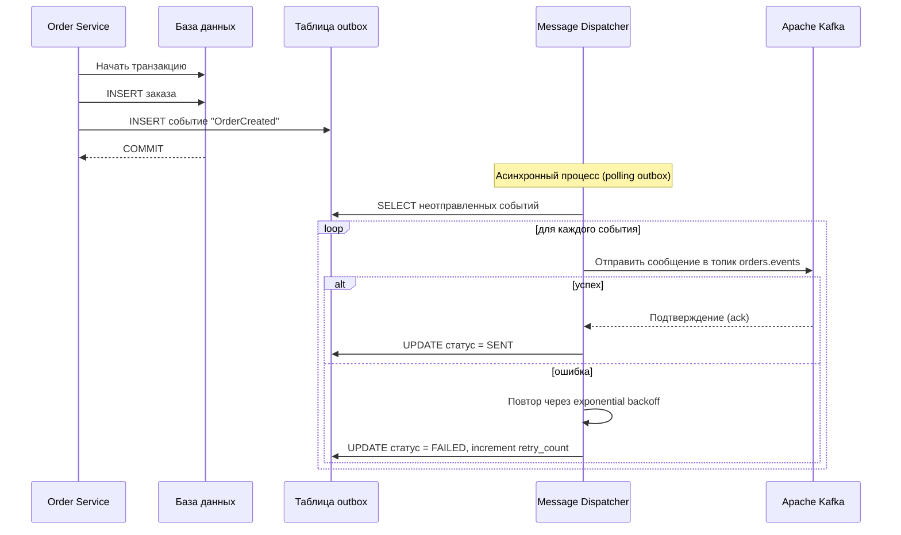

---
tags:
  - integration
  - messaging
  - producer
  - kafka
  - rabbitmq
  - async
  - template
  - documentation
  - system_analysis
---
# Шаблон спецификации Producer (Kafka / RabbitMQ)

Producer — это компонент (микросервис, модуль, процесс), который в ответ на определённое событие или по расписанию формирует и отправляет сообщение в брокер (топик Kafka, очередь RabbitMQ, шину событий). Данный шаблон охватывает все аспекты, которые системный аналитик должен зафиксировать для передачи задачи разработчикам и тестировщикам.

---

## 1. Общая информация

| Поле                      | Описание                                                                                                                                         |
| ------------------------- | ------------------------------------------------------------------------------------------------------------------------------------------------ |
| **Наименование Producer** | `<Уникальное имя, например: OrderEventsProducer>`                                                                                                |
| **Бизнес-контекст**       | `<Какое событие предметной области инициирует отправку? Зачем отправляется сообщение? Кто потребители? Ссылка на бизнес-процесс или прецедент.>` |
| **Связанные требования**  | `<Идентификаторы функциональных и нефункциональных требований.>`                                                                                 |
| **Владелец компонента**   | `<Команда/сервис, отвечающий за отправку.>`                                                                                                      |
| **Инициатор отправки**    | `<Пользовательское действие, срабатывание таймера, завершение другого процесса, вызов API, событие БД.>`                                         |

---

## 2. Параметры брокера и топика/очереди

| Параметр                             | Значение                                                                                          |
| ------------------------------------ | ------------------------------------------------------------------------------------------------- |
| **Тип брокера**                      | `Apache Kafka` / `RabbitMQ` / `AWS SQS` / `Azure Service Bus`                                     |
| **Имя топика / обменника / очереди** | `<events.order.created>`                                                                          |
| **Партиционирование (для Kafka)**    | `<Ключ партиционирования: orderId (хэш для равномерного распределения). Количество партиций: 6.>` |
| **Тип маршрутизации (для RabbitMQ)** | `<Exchange: orders.topic, тип: topic, routing key: order.created.v1>`                             |
| **Сериализация**                     | `JSON` / `Avro` / `Protobuf` (с указанием схемы)                                                  |
| **Степень сжатия**                   | `gzip` / `snappy` / `none` (если применимо)                                                       |
| **Репликация и надёжность**          | `acks=all (Kafka), min.insync.replicas=2` / `persistent delivery mode (RabbitMQ)`                 |
| **Таймаут отправки**                 | `2000 мс`                                                                                         |
| **Повторные попытки при ошибке**     | `3 попытки с экспоненциальной задержкой (100мс, 200мс, 400мс)`                                    |

---

## 3. Структура сообщения

### 3.1. Ключ сообщения (Message Key)

Для Kafka ключ определяет партицию и используется для хронологической упорядоченности в рамках одного ключа.

| Поле ключа | Тип | Описание | Пример |
|---|---|---|---|
| `orderId` | `String (UUID)` | Уникальный идентификатор заказа | `"a1b2c3d4-..."` |

**Логика выбора ключа:** `<Все события по одному заказу должны попадать в одну и ту же партицию, поэтому ключ — идентификатор заказа.>`

### 3.2. Тело сообщения (Value)

**Схема (JSON Schema / Avro Schema):**

```json
{
  "$schema": "http://json-schema.org/draft-07/schema#",
  "title": "OrderCreatedEvent",
  "type": "object",
  "properties": {
    "eventId": { "type": "string", "format": "uuid" },
    "eventType": { "const": "OrderCreated" },
    "occurredAt": { "type": "string", "format": "date-time" },
    "order": {
      "type": "object",
      "properties": {
        "orderId": { "type": "string", "format": "uuid" },
        "userId": { "type": "string", "format": "uuid" },
        "totalAmount": { "type": "number" },
        "currency": { "type": "string", "minLength": 3, "maxLength": 3 },
        "items": {
          "type": "array",
          "items": { "$ref": "#/definitions/OrderItem" }
        }
      },
      "required": ["orderId", "userId", "totalAmount", "currency", "items"]
    }
  },
  "required": ["eventId", "eventType", "occurredAt", "order"],
  "definitions": {
    "OrderItem": {
      "type": "object",
      "properties": {
        "sku": { "type": "string" },
        "quantity": { "type": "integer", "minimum": 1 },
        "price": { "type": "number" }
      },
      "required": ["sku", "quantity", "price"]
    }
  }
}
```

**Описание полей (для документации):**

| Путь | Тип | Обязательность | Описание | Пример |
|---|---|---|---|---|
| `eventId` | UUID | Да | Уникальный идентификатор события (для дедупликации) | `"f47ac10b-58cc-4372-a567-0e02b2c3d479"` |
| `eventType` | String | Да | Тип события (постоянный литерал) | `"OrderCreated"` |
| `occurredAt` | ISO 8601 | Да | Время возникновения события на стороне producer | `"2025-05-27T10:15:30Z"` |
| `order.orderId` | UUID | Да | Идентификатор заказа | |
| `order.userId` | UUID | Да | Идентификатор покупателя | |
| `order.totalAmount` | Decimal | Да | Сумма заказа в валюте | `2590.00` |
| `order.currency` | String(3) | Да | Код валюты ISO 4217 | `"RUB"` |
| `order.items[]` | Array | Да | Список позиций заказа | |
| `order.items[].sku` | String | Да | Артикул товара | `"AB-12345"` |
| `order.items[].quantity` | Integer | Да | Количество | `2` |
| `order.items[].price` | Decimal | Да | Цена за единицу | `1295.00` |

**Пример сериализованного сообщения (JSON):**

```json
{
  "eventId": "f47ac10b-58cc-4372-a567-0e02b2c3d479",
  "eventType": "OrderCreated",
  "occurredAt": "2025-05-27T10:15:30Z",
  "order": {
    "orderId": "a1b2c3d4-e5f6-7890-abcd-ef1234567890",
    "userId": "u123456",
    "totalAmount": 2590.00,
    "currency": "RUB",
    "items": [
      {
        "sku": "AB-12345",
        "quantity": 2,
        "price": 1295.00
      }
    ]
  }
}
```

---

## 4. Условия отправки (триггер)

Опишите, какое именно событие или условие приводит к публикации сообщения.

- **Бизнес-событие:** После успешного сохранения заказа в БД и подтверждения оплаты.
- **Техническое событие:** После фиксации транзакции в БД (post-commit hook). Если транзакция откатилась, сообщение не отправляется.
- **Транзакционная согласованность:** `<Используется паттерн Transactional Outbox: запись в таблицу outbox в той же транзакции, затем отдельный процесс-диспетчер отправляет в Kafka.>`

Укажите, является ли отправка **синхронной** (ожидание подтверждения брокера) или **асинхронной** (fire-and-forget). Для критичных событий обычно ожидают подтверждения.

---

## 5. Обработка ошибок отправки

Опишите сценарии, когда сообщение не удалось доставить в брокер.

| Ситуация | Код / Причина | Действие Producer | Влияние на потребителя |
|---|---|---|---|
| Таймаут подключения к брокеру | `TimeoutException` | Повторная отправка до 3 раз, затем ошибка уровня ERROR в лог и метрика | Сообщение не доставлено; может потребоваться ручная компенсация или повтор из outbox |
| Брокер вернул ошибку (лидер партиции недоступен) | `NotEnoughReplicasException` | Повтор с экспоненциальной задержкой | Сообщение может быть отложено, но доставлено позже |
| Сериализация сообщения не удалась | `SerializationException` | Сообщение отбрасывается, инцидент в систему мониторинга | Никакого события; требуется исправление схемы данных |
| Превышен размер сообщения | `RecordTooLargeException` | Сообщение не отправляется, алерт; возможно, нужен уменьшенный payload или chunking | – |

**Важно:** если producer участвует в распределённой транзакции, то при ошибке отправки может быть инициирован компенсационный механизм (Saga orchestration).

---

## 6. Мониторинг и метрики

Какие метрики должен экспортировать Producer для контроля здоровья интеграции:

- `producer_sent_total` (counter) — общее количество успешно отправленных сообщений.
- `producer_error_total` (counter) — количество ошибок отправки.
- `producer_latency_seconds` (histogram) — время отправки (включая повторы).
- `producer_outbox_pending` (gauge) — количество записей в таблице outbox, ожидающих отправки.

Также обязателен алерт при превышении `producer_error_total` порога за 5-минутное окно.

---

## 7. Диаграмма взаимодействия (Producer)



---

## 8. Версионирование и обратная совместимость (необязательно)

- **Версия схемы:** `1.0.0`
- **Стратегия эволюции:** Только прямо совместимые изменения (добавление необязательных полей). Изменение обязательных полей или их типа — через новую версию события (eventType или routing key).
- **Реестр схем:** Confluent Schema Registry (для Avro) / Git-репозиторий JSON Schema.

При изменении схемы producer должен:
1. Увеличить версию схемы.
2. Уведомить владельцев Consumer о необходимости обновления десериализации (или обеспечить двойную публикацию в переходный период).

---

## 9. Пример отладочного запуска (необязательно)

Приведите команду или скрипт, позволяющий вручную отправить тестовое сообщение.

```bash
# Kafka console producer
kafka-console-producer --broker-list localhost:9092 --topic orders.events \
  --property "parse.key=true" --property "key.separator=:"
> a1b2c3d4-e5f6-7890-abcd-ef1234567890:{"eventId":"...", "eventType":"OrderCreated", ...}
```

---

## 10. Примечания и ограничения (необязательно)

- Гарантия доставки: **at-least-once** (возможны дубликаты при повторах). Consumer должен быть идемпотентным.
- Максимальная задержка между бизнес-событием и фактической отправкой в Kafka: не более 500 мс при нормальной работе (outbox polling interval = 100 мс).
- Пропускная способность: до 500 сообщений/сек на прод. среде.