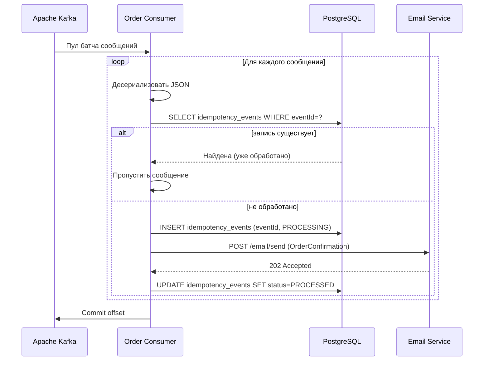

---
tags:
  - integration
  - messaging
  - consumer
  - kafka
  - rabbitmq
  - async
  - template
  - documentation
  - system_analysis
---
# Шаблон спецификации Consumer (Kafka / RabbitMQ)

Consumer — это компонент, который читает сообщения из брокера (топика Kafka, очереди RabbitMQ), десериализует их, выполняет бизнес-логику и фиксирует факт обработки (commit offset). В отличие от синхронного API, Consumer должен быть спроектирован для идемпотентной обработки, корректного управления смещениями и обработки ошибок без потери данных.

Настоящий шаблон охватывает все аспекты, которые системный аналитик обязан проработать для передачи в разработку. Используйте совместно с:
- [[03.05.03 Асинхронное взаимодействие (очереди, Kafka, Events)]]
- [[03.05.06 Шаблон спецификации Producer (Kafka / RabbitMQ)]] — парный шаблон отправителя.
- [[03.01.04 Интерфейсы и интеграционные взаимодействия]]

---

## 1. Общая информация

| Поле | Описание |
|---|---|
| **Наименование Consumer** | `<Уникальное имя, например: OrderCreatedConsumer>` |
| **Бизнес-контекст** | `<Какую задачу выполняет обработчик? На какое бизнес-событие он реагирует? Ссылка на бизнес-процесс.>` |
| **Владелец компонента** | `<Команда, отвечающая за логику обработки.>` |
| **Входной топик / очередь** | `<events.order.created>` |
| **Ожидаемый формат сообщений** | `<JSON, Avro (с указанием схемы)>` |
| **Режим работы** | `At-least-once` / `Exactly-once` (поддержка транзакций Kafka) |

---

## 2. Параметры подключения и конфигурация Consumer

| Параметр | Значение |
|---|---|
| **Брокер / кластер** | `<Адрес брокера: kafka-broker.internal:9092>` |
| **Имя Consumer Group** | `<order-service-notification-group>` |
| **Автосброс offset** | `earliest` (начать с первого сообщения) / `latest` (только новые) |
| **Стратегия партиционирования (Kafka)** | `<Range / RoundRobin / Sticky>` |
| **Максимальный размер батча** | `500 записей` |
| **Таймаут опроса** | `500 мс` |
| **Параллелизм** | `3 потока (по одному на партицию)` |

---

## 3. Десериализация и валидация сообщений

### 3.1. Схема и формат

Указывается ссылка на схему (JSON Schema, Avro) и правила десериализации. Если используется Schema Registry — его адрес и стратегия проверки.

**Проверки на стороне Consumer:**
- Соответствие JSON структуре обязательных полей.
- Бизнес-валидация (например, `order.totalAmount > 0`).
- Проверка идентификатора события: не обработано ли оно ранее (дедупликация).

### 3.2. Обработка невалидных сообщений (Poison Pill)

| Тип ошибки | Поведение |
|---|---|
| **Невозможно десериализовать** (нарушение формата JSON/Avro) | Сообщение немедленно отправляется в **Dead Letter Topic** (DLT) `orders.events.dlt`, метрика `poison_message_total` увеличена. Обработка основного потока продолжается. |
| **Сообщение не проходит бизнес-валидацию** | Аналогично: сообщение перенаправляется в DLT с заголовками ошибки. |
| **Временный сбой (БД недоступна)** | Повторная попытка без отправки в DLT, с задержкой (см. раздел «Обработка ошибок»). |

---

## 4. Логика обработки (алгоритм)

Опишите последовательность шагов после получения валидного сообщения.

### 4.1. Основной поток

1. **Десериализовать** сообщение в объект `OrderCreatedEvent`.
2. **Проверить идемпотентность:** запросить из БД запись по `eventId`. Если уже существует запись со статусом «Обработано», подтвердить offset и завершить (дубликат).
3. **Выполнить бизнес-операцию:**
   - Создать запись в таблице `notifications` (уведомление пользователю).
   - Вызвать API Email-сервиса: `POST /email/send` с шаблоном «Заказ подтверждён».
   - Обновить статус обработки в таблице `idempotency_events` (`eventId`, статус `PROCESSED`, время).
4. **Зафиксировать offset** в Kafka (commit).

### 4.2. Диаграмма последовательности



---

## 5. Обработка ошибок и стратегии восстановления

Определите для каждой группы ошибок реакцию Consumer.

| Сценарий | Способ обработки | Задержка/Повторы | Результат |
|---|---|---|---|
| **Временная недоступность БД** | Повторить обработку без отправки в DLT | 3 попытки с backoff (200мс, 400мс, 800мс) | После превышения — останов Consumer и алерт |
| **Сбой Email-сервиса (5xx)** | Повторная попытка, так как операция не идемпотентна | 3 попытки, затем DLT | Сообщение в DLT с пометкой «EMAIL_FAILED» |
| **Ошибка валидации email-адреса** (бизнес-логика) | Нет повторных попыток; сообщение в DLT | 0 | DLT + оповещение администратора |
| **Дубликат сообщения (уже обработано)** | Пропуск, подтверждение offset | – | – |
| **Превышение таймаута обработки батча** | Завершить текущую обработку, закоммитить только успешные offset’ы, оставшиеся сообщения не коммитятся и будут перечитаны | – | Повторная обработка необработанных |

**Dead Letter Topic (DLT):** `orders.events.dlt` с сохранением исходного сообщения, заголовков ошибки и временной метки.

---

## 6. Идемпотентность и дедупликация (необязательно)

**Метод обеспечения:** Наличие таблицы `idempotency_events` с уникальным ограничением на `eventId`. Перед выполнением бизнес-операции вставляется запись со статусом `PROCESSING`. После успешного завершения — обновление статуса. Если сообщение повторно доставлено после успешной обработки, Consumer находит запись и пропускает выполнение, но подтверждает offset.

**Срок хранения ключей идемпотентности:** 30 дней, после чего старые записи удаляются. (Следует убедиться, что брокер не перепрочитает сообщение старше этого срока.)

---

## 7. Влияние на другие сервисы и побочные эффекты (необязательно)

Перечислите все вызовы к внешним системам, изменения в БД, отправку других событий.

| Действие | Тип (БД / API / Event) | Компонент-получатель | Критичность | Альтернатива при отказе |
|---|---|---|---|---|
| Сохранение статуса обработки | INSERT/UPDATE | PostgreSQL (локальная БД) | Высокая | – |
| Отправка email | REST POST | Email Service | Средняя | DLT, ручная переотправка |
| Публикация события `NotificationSent` (опционально) | Kafka | topic `notifications.events` | Низкая | Игнорировать ошибку |

---

## 8. Мониторинг и алерты (необязательно)

- `consumer_messages_total` (counter) — общее количество полученных сообщений.
- `consumer_processed_total` (counter) — успешно обработанные.
- `consumer_dlt_total` (counter) — сообщения, отправленные в DLT.
- `consumer_lag` (gauge) — текущий лаг Consumer Group.
- `consumer_error_rate` — процент ошибок за окно.

**Алерты:**
- `consumer_lag > 10000` — предупреждение о накоплении.
- `consumer_dlt_total рост > 10 за 5 минут` — алерт команде на проверку poison-сообщений.

---

## 9. Версионирование сообщений и совместимость (необязательно)

Consumer должен корректно обрабатывать эволюцию схемы.

- **Стратегия:** Игнорировать неизвестные поля (forward compatibility), для отсутствующих необязательных полей использовать значения по умолчанию.
- **При добавлении нового обязательного поля** Consumer должен сначала обновиться для поддержки, затем Producer начинает отправлять новую версию.
- **Реестр схем:** Та же система, что у Producer (Schema Registry или JSON Schema git).

---

## 10. Пример отладки (необязательно)

```bash
kafka-console-consumer --bootstrap-server localhost:9092 \
  --topic orders.events --group order-service-debug --from-beginning
```

При наличии инструмента типа Kafka Connect или kcat можно имитировать входящее сообщение.

---

## 11. Примечания и ограничения (необязательно)

- Гарантии обработки: **at-least-once**, требуется идемпотентность Consumer.
- Параллелизм: количество потоков ≤ количество партиций топика.
- Максимальное время обработки одного сообщения: 5 секунд. При превышении Consumer считается «зависшим» и может быть перебалансирован, offset не коммитится.
- Объём памяти для буферизации батча: до 10 МБ.