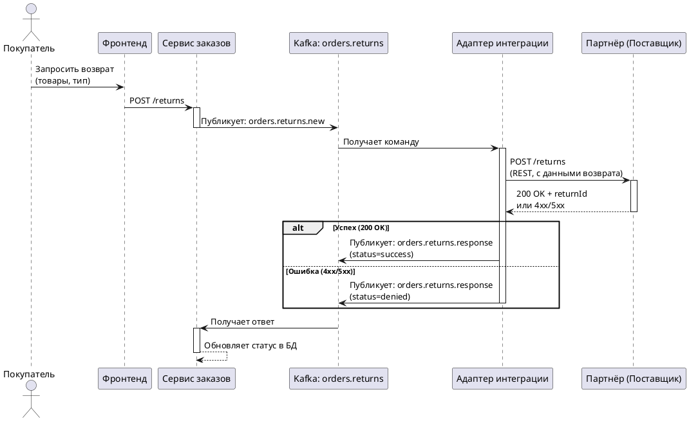

![[Pasted image 20260528190929.png]]

```plantuml
@startuml
actor Покупатель
participant "Фронтенд" as Frontend
participant "Сервис заказов" as OrdersService
participant "Kafka: orders.returns" as Kafka
participant "Адаптер интеграции" as Adapter
participant "Партнёр (Поставщик)" as Partner


Покупатель -> Frontend : Запросить возврат\n(товары, тип)
Frontend -> OrdersService : POST /returns
activate OrdersService

OrdersService -> Kafka : Публикует: orders.returns.new
deactivate OrdersService

Kafka -> Adapter : Получает команду
activate Adapter

Adapter -> Partner : POST /returns\n(REST, с данными возврата)
activate Partner
Partner --> Adapter : 200 OK + returnId\nили 4xx/5xx
deactivate Partner

alt Успех (200 OK)
    Adapter -> Kafka : Публикует: orders.returns.response \n(status=success)
else Ошибка (4xx/5xx)
    Adapter -> Kafka : Публикует: orders.returns.response \n(status=denied)
deactivate Adapter
end

Kafka -> OrdersService : Получает ответ 
activate OrdersService
OrdersService --> OrdersService : Обновляет статус в БД

deactivate OrdersService

@enduml
```

тестовая строка для обучения созданию отдельных веток в гите и последующем создании пулл реквестов